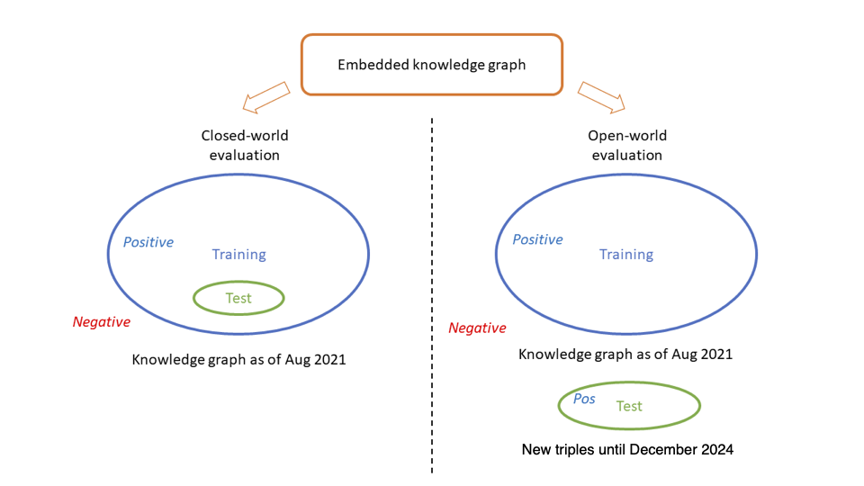

# Threat Knowledge Graph

This repository contains accompanying materials to our work entitled [*Uncovering Product Vulnerabilities with Threat Knowledge Graphs*](https://ieeexplore.ieee.org/abstract/document/9973028). In this work, we generate a **threat knowledge graph** from public threat databases, including Common Platform Enumeration (CPE), Common Vulnerabilities and Exposures (CVE), and Common Weakness Enumeration (CWE). Through knowledge graph embedding, we are able to uncover the CVE-CPE and CVE-CWE associations that might exist but are not known yet.

## Overview

This repository has three main folders: `/preprocess/`, `/threat_kg/`, and `/neo4j_import/`.

The `/preprocess/` folder contains the document on pre-processing the CPE, CVE, and CWE databases from their original formats to CSV files. This pre-processing step is documented in `database_preprocessing.md`. The processed databases are saved in `/csv_file/`. Moreover, the code for pre-processing is provided under `/py_code/`.

The `/threat_kg/` folder contains materials relevant to the threat knowledge graph, including generation, embedding, evaluation, and prediction. The details are documented in the Jupyter Notebook called `threat_knowledge_graph.ipynb`. Under the `/saved/` folder, we also save a few important files during this process for reuse, such as the knowledge graph as a list of triples.

The `/neo4j_import/` folder contains the document on importing the knowledge graph to [Neo4j Graph Database](https://neo4j.com/) for visualization and query. This process is detailed in `threat_kg_with_neo4j.md`. The knowledge graph is stored as a set of CSV files under `/files/`, such that it can be easily imported into Neo4j.

## Workflow

Our workflow is illustrated in the following figure:


First, we download the CPE, CVE, and CWE data feed from the MITRE and NVD websites. The downloaded databases are in their original formats, such as JSON and XML. Next, we run our Python code to pre-process those databases into CSV files. We then import the CSV files into a Jupyter Notebook as Pandas DataFrames, and extract the knowledge graph triples from them. The knowledge graph is represented as a long list of triples, and the embedding process is completed with the help of a Python package named AmpliGraph.

With the embedded knowledge graph, we can evaluate its quality and prediction capability using standard metrics. We conduct both closed-world evaluation, where the test set is a subset of the knowledge graph, and open-world evaluation, where the test set consists of newly added triples that were not in the knowledge graph. This evaluation process is illustrated in the figure below.




## License

These materials may be freely used and distributed, provided that attribution to this original source is acknowledged. If you use the resources in this repository, we kindly ask that you refer to the following work:

- Z. Shi, N. Matyunin, K. Graffi, and D. Starobinski, “Uncovering product vulnerabilities with threat knowledge graphs,” in *2022 IEEE Secure Development Conference (SecDev)*. IEEE, 2022, pp. 84–90.
    ```
    @inproceedings{shi2022uncovering,
    title={Uncovering Product Vulnerabilities with Threat Knowledge Graphs},
    author={Shi, Zhenpeng and Matyunin, Nikolay and Graffi, Kalman and Starobinski, David},
    booktitle={2022 IEEE Secure Development Conference (SecDev)},
    pages={84--90},
    year={2022},
    organization={IEEE}
    }
    ```
- Z. Shi, N. Matyunin, K. Graffi, and D. Starobinski, “Uncovering CWE-CVE-CPE relations with threat knowledge graphs,” arXiv preprint arXiv:2305.00632, 2023.
    ```
    @article{shi2023uncovering,
    title={Uncovering CWE-CVE-CPE Relations with Threat Knowledge Graphs},
    author={Shi, Zhenpeng and Matyunin, Nikolay and Graffi, Kalman and Starobinski, David},
    journal={arXiv preprint arXiv:2305.00632},
    year={2023}
    }
    ```

## Acknowledgments

This project was supported in part by
- The Red Hat Collaboratory at Boston University
- The US National Science Foundation
- Honda Research Institute Europe GmbH and BU Hariri Institute Research Incubation Award 
  
