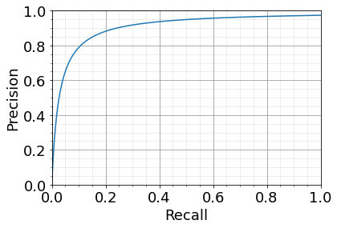

## Categorizing Erroneous Mappings using Knowledge Graphs (KG) & Predicting Top N CWE mappings for CVE using KG querying

This document uses our original knowledge graph construction and training [tutorial](https://github.com/nislab/threat-knowledge-graph/blob/main/threat_kg/threat_knowledge_graph.ipynb), and using the trained embedding models, we show the process of categorizing erroneous mappings, and querying for the top N CVE-MatchingCWE-CWE triples


```python
!pip install ampligraph==1.4.0
!pip install matplotlib
```


```python
import numpy as np
import pandas as pd
import ampligraph
import warnings
warnings.filterwarnings("ignore")
```


```python
ampligraph.__version__ #checking if package is installed correctly.
```


    '1.4.0'


Here we process the triples to construct the knowledge graph. These triples come from the August 2021 data.
Models are trained and saved so we can use these for consistency.


```python
triples = []

triples_df = pd.read_csv("../datasets/processed/saved/kg_demo_aug2021.csv", usecols=["subject", "predicate", "object"])

for i,r in triples_df.iterrows():
    triples.append([r['subject'],r['predicate'],r['object']])
```

The models are saved and can be loaded from file to speed up the process.


```python
from ampligraph.latent_features import restore_model
model_transe = restore_model('../datasets/processed/saved/kg_demo_model_transe_aug2021.pkl')
model_distmult = restore_model('../datasets/processed/saved/kg_demo_model_DistMult_aug2021.pkl')
model_complex = restore_model('../datasets/processed/saved/kg_demo_model_ComplEx_aug2021.pkl')
```


```python
train_df = pd.read_csv("../output/kg_demo_train_aug2021.csv", usecols=["subject", "predicate", "object"])
valid_df = pd.read_csv("../output/kg_demo_valid_aug2021.csv", usecols=["subject", "predicate", "object"])

X_train = train_df.to_numpy()
X_valid = valid_df.to_numpy()
```


```python
filter_triples = np.concatenate((X_train, X_valid))
```


```python
print('Train set size: ', X_train.shape)
print('Test set size: ', X_valid.shape)
```

    Train set size:  (363225, 3)
    Test set size:  (10000, 3)


The following are the triples specific to cpe-cve and cwe-cve, which are the key triples that we are focusing on.


```python
kg_cpe2cve = []
kg_cve2cwe = []

kg_cpe2cve_df = pd.read_csv("../datasets/processed/saved/cpe2cve-aug2021.csv")
for i,r in kg_cpe2cve_df.iterrows():
    kg_cpe2cve.append([r['subject'],r['predicate'],r['object']])

kg_cve2cwe_df = pd.read_csv("../datasets/processed/saved/cve2cwe-aug2021.csv")
for i,r in kg_cve2cwe_df.iterrows():
    kg_cve2cwe.append([r['subject'],r['predicate'],r['object']])
```

Now, we construct the new set of triples (CVE-CWE and CVE-CPE) using the updated snapshot of the NVD 


```python
kg_cpe2cve_nov2022 = []

kg_cpe2cve_nov2022_df = pd.read_csv("../datasets/processed/saved/cpe2cve-nov2022.csv")
for i,r in kg_cpe2cve_nov2022_df.iterrows():
    kg_cpe2cve_nov2022.append([r['subject'],r['predicate'],r['object']])

kg_cve2cwe_nov2022 = []

kg_cve2cwe_2022_df = pd.read_csv("../datasets/processed/saved/cve2cwe-nov2022.csv")
for i,r in kg_cve2cwe_2022_df.iterrows():
    kg_cve2cwe_nov2022.append([r['subject'],r['predicate'],r['object']])
```


```python
new_cve2cwe = []

li1 = []
li2 = []
for l in kg_cve2cwe_nov2022:
    li1.append(l[0]+','+l[1]+','+l[2])
for l in kg_cve2cwe:
    li2.append(l[0]+','+l[1]+','+l[2])

new_tmp = list(set(li1) - set(li2))
for s in new_tmp:
    new_cve2cwe.append(s.split(','))

new_cve2cwe_df = pd.DataFrame(new_cve2cwe,columns=["subject", "predicate", "object"]).sort_values(by=['subject'],ascending=True).reset_index(drop=True)
```


```python
new_test_cve2cwe = []

kg_cve2cwe_df = pd.DataFrame(kg_cve2cwe, columns=["subject", "predicate", "object"])

for i, r in new_cve2cwe_df.iterrows():
    if r['subject'] in kg_cve2cwe_df['subject'].values:
        new_test_cve2cwe.append(r)
```


```python
new_cpe2cve = []

li1 = []
li2 = []
for l in kg_cpe2cve_nov2022:
    li1.append(l[0]+','+l[1]+','+l[2])
for l in kg_cpe2cve:
    li2.append(l[0]+','+l[1]+','+l[2])

new_tmp = list(set(li1) - set(li2))
for s in new_tmp:
    new_cpe2cve.append(s.split(','))

new_cpe2cve_df = pd.DataFrame(new_cpe2cve, columns=["subject", "predicate", "object"]).sort_values(by=['subject'], ascending=True).reset_index(drop=True)
```

## Get the set of removed triples for each cve-cwe and cve-cpe triples. 

The set of removed triples are obtained using the difference, where there will also be newly added triples that did not exist in the previous version of the NVD (knowledge graph). Therefore, we will keep only the triples that existed in the August 2021 set of triples, and were removed on or before November 2022. 

```python
removed_cwe2cve = []
removed_cpe2cve = []

#for each triple, we check if it exists in any of the lists
#we have: kg_cpe2cve_nov2022 and kg_cve2cwe_2022_df

li1 = []
li2 = []
l1 =[]
l2 = []
for l in kg_cpe2cve_nov2022:
    l1.append(l[0]+','+l[1]+','+l[2])
for l in kg_cve2cwe_nov2022:
    li1.append(l[0]+','+l[1]+','+l[2])
for l in kg_cpe2cve:
    l2.append(l[0]+','+l[1]+','+l[2])
for l in kg_cve2cwe:
    li2.append(l[0] + ',' + l[1] + ',' + l[2])

new_tmp1 = list(set(li2) - set(li1))
new_tmp2 = list(set(l2)- set(l1))

for s in new_tmp1:
    removed_cwe2cve.append(s.split(','))
for s in new_tmp2:
    removed_cpe2cve.append(s.split(','))


```


```python
removed_cwe2cve_df = pd.DataFrame(removed_cwe2cve, columns=["subject", "predicate", "object"]).sort_values(by=['subject'], ascending=True).reset_index(drop=True)

removed_cpe2cve_df = pd.DataFrame(removed_cpe2cve, columns=["subject", "predicate", "object"]).sort_values(by=['subject'], ascending=True).reset_index(drop=True)

```


```python
removed_cwe2cve_df.to_csv('../datasets/processed/saved/removed_cwe2cve.csv', index=False)
removed_cpe2cve_df.to_csv('../datasets/processed/saved/removed_cpe2cve.csv', index=False)
```

Here we keep only entries already in kg

```python
# keep only entries already in kg

removed_test_cve2cwe = []

kg_cve2cwe_df = pd.DataFrame(kg_cve2cwe, columns=["subject", "predicate", "object"])

for i, r in removed_cwe2cve_df.iterrows():
    if r['subject'] in kg_cve2cwe_df['subject'].values:
        removed_test_cve2cwe.append(r)
```


```python
removed_test_cve2cpe = []

kg_cve2cpe_df = pd.DataFrame(kg_cpe2cve_df, columns=["subject", "predicate", "object"])

for i, r in removed_cpe2cve_df.iterrows():
    if r['subject'] in kg_cpe2cve_df['subject'].values:
        removed_test_cve2cpe.append(r)
```


```python
print(len(removed_test_cve2cpe))
print(len(removed_test_cve2cwe))
```

    1318
    2313

Saving this set for avoiding this process each time we need to use the set of removed triples. 

```python
pd.DataFrame(removed_test_cve2cwe, columns=["subject", "predicate", "object"]).to_csv('./removed_cwe2cve.csv', index=False)
pd.DataFrame(removed_test_cve2cpe, columns=["subject", "predicate", "object"]).to_csv('./removed_cpe2cve.csv', index=False)
```

After we obtain the number of triples that we detect, which are removed from the database between August 2021 and November 2022, we use triples to evaluate the model's performance in ranking them reasonably low, or lower than the positive triples. (high rank= smaller rank number (1,2, top N) low rank = bigger rank number (e.g. 1234, 2335443).

First training TransE model, with removed CVE-CWE triples. 

```python
ranks_te = evaluate_performance(np.array(removed_test_cve2cwe),model=model_transe,filter_triples=None,verbose=True)
```

```python
ranks_te_rm = pd.DataFrame(ranks_te, columns=["subject", "object"])
ranks_te_rm.to_csv('../output/ranks_te_rm_cwe.csv', index=False)
```

```python
ranks_te_rm = []
ranks_te_rm_df = pd.read_csv('../output/ranks_te_rm_cwe.csv',usecols = ["subject", "object"])
for i,r in ranks_te_rm_df.iterrows():
    ranks_te_rm.append([r['subject'],r['object']])
```

Now training TransE model, with removed CVE-CPE triples. 

```python
ranks_te2 = evaluate_performance(np.array(removed_cpe2cve_df),model=model_transe,filter_triples=None,verbose=True)
```

```python
ranks_te_rm2 = pd.DataFrame(ranks_te2, columns=["subject", "object"])
ranks_te_rm2.to_csv('../output/ranks_te_rm_cpe.csv', index=False)
```

```python
ranks_te_rm2 = []
ranks_te_rm2_df = pd.read_csv('../output/ranks_te_rm_cpe.csv',usecols = ["subject", "object"])
for i,r in ranks_te_rm2_df.iterrows():
    ranks_te_rm2.append([r['subject'],r['object']])
```

Training DistMult model, with removed CVE-CWE triples. 

```python
ranks_dm = evaluate_performance(np.array(removed_test_cve2cwe),model=model_transe,filter_triples=None,verbose=True)
```

```python
ranks_dm_rm = pd.DataFrame(ranks_dm, columns=["subject", "object"])
ranks_dm_rm.to_csv('../output/ranks_dm_rm_cwe.csv', index=False)
```


```python
ranks_dm_rm = []
ranks_dm_rm_df = pd.read_csv('../output/ranks_dm_rm_cwe.csv',usecols = ["subject", "object"])
for i,r in ranks_dm_rm_df.iterrows():
    ranks_dm_rm.append([r['subject'],r['object']])
```

Training DistMult model, with removed CVE-CPE triples. 

```python
ranks_dm2 = evaluate_performance(np.array(removed_cpe2cve_df),
                             model=model_distmult,
                             filter_triples=None,
                             verbose=True)
```

```python
ranks_dm_rm2 = pd.DataFrame(ranks_dm2, columns=["subject", "object"])
ranks_dm_rm2.to_csv('../output/ranks_dm_rm_cpe.csv', index=False)
```


```python
ranks_dm_rm2 = []
ranks_dm_rm2_df = pd.read_csv('../output/ranks_dm_rm_cpe.csv',usecols = ["subject", "object"])
for i,r in ranks_dm_rm2_df.iterrows():
    ranks_dm_rm2.append([r['subject'],r['object']])
```
Training ComplEx model, with removed CVE-CWE triples. 

```python
ranks_ce = evaluate_performance(np.array(removed_test_cve2cwe),model=model_complex,filter_triples=None,verbose=True)
```


```python
ranks_ce_rm = pd.DataFrame(ranks_ce, columns=["subject", "object"])
ranks_ce_rm.to_csv('../output/ranks_ce_rm_cwe.csv', index=False)
```


```python
ranks_ce_rm = []
ranks_ce_rm_df = pd.read_csv('../output/ranks_ce_rm_cwe.csv',usecols = ["subject", "object"])
for i,r in ranks_ce_rm_df.iterrows():
    ranks_ce_rm.append([r['subject'],r['object']])
```

Training ComplEx model, with removed CVE-CPE triples. 

```python
ranks_ce2 = evaluate_performance(np.array(removed_cpe2cve_df), model=model_complex, filter_triples=None,verbose=True)
```


```python
ranks_ce_rm2 = pd.DataFrame(ranks_ce2, columns=["subject", "object"])
ranks_ce_rm2.to_csv('../output/ranks_ce_rm_cpe.csv', index=False)
```


```python
ranks_ce_rm2 = []
ranks_ce_rm2_df= pd.read_csv('../output/ranks_ce_rm_cpe.csv',usecols = ["subject", "object"])
for i,r in ranks_ce_rm2_df.iterrows():
    ranks_ce_rm2.append([r['subject'],r['object']])
```


```python
from ampligraph.evaluation import mr_score, mrr_score, hits_at_n_score
```
Printing each embedding model's performance with both removed CVE-CWE and CVE-CPE triple sets.

```python
ranks_list = [ranks_te_rm, ranks_te_rm2, ranks_dm_rm, ranks_dm_rm2, ranks_ce_rm, ranks_ce_rm2]
ranks_names = ["TransE, CVE to CWE", "TransE, CVE to CPE", "DistMult, CVE to CWE",
               "DistMult, CVE to CPE", "ComplEx, CVE to CWE", "Complex, CVE to CPE"]

i=0

for ranks in ranks_list:
    print (ranks_names [i])
    i = i+1
    mr = mr_score(ranks)
    mrr = mrr_score(ranks)

    print("MRR: %.3f" % (mrr))
    print("MR: %.3f" % (mr))

    hits_20 = hits_at_n_score(ranks, n=20)
    print("Hits@20: %.3f" % (hits_20))
    hits_10 = hits_at_n_score(ranks, n=10)
    print("Hits@10: %.3f" % (hits_10))
    hits_3 = hits_at_n_score(ranks, n=3)
    print("Hits@3: %.3f" % (hits_3))
    hits_1 = hits_at_n_score(ranks, n=1)
    print("Hits@1: %.3f" % (hits_1))
    print('\n')
```

    TransE, CVE to CWE
    MRR: 0.253
    MR: 1416.722
    Hits@20: 0.530
    Hits@10: 0.515
    Hits@3: 0.494
    Hits@1: 0.007
    
    
    TransE, CVE to CPE
    MRR: 0.214
    MR: 643.995
    Hits@20: 0.676
    Hits@10: 0.579
    Hits@3: 0.365
    Hits@1: 0.004
    
    
    DistMult, CVE to CWE
    MRR: 0.253
    MR: 1416.722
    Hits@20: 0.530
    Hits@10: 0.515
    Hits@3: 0.494
    Hits@1: 0.007
    
    
    DistMult, CVE to CPE
    MRR: 0.198
    MR: 801.186
    Hits@20: 0.700
    Hits@10: 0.567
    Hits@3: 0.317
    Hits@1: 0.004
    
    
    ComplEx, CVE to CWE
    MRR: 0.252
    MR: 1704.847
    Hits@20: 0.530
    Hits@10: 0.516
    Hits@3: 0.497
    Hits@1: 0.006
    
    
    Complex, CVE to CPE
    MRR: 0.261
    MR: 765.186
    Hits@20: 0.812
    Hits@10: 0.693
    Hits@3: 0.463
    Hits@1: 0.006
    
    


## PLOTS

### PRECISION, RECALL, F1 SCORES
Other than the typical knowledge-graph-related metrics, we can also get prediction-related metrics, including precision, recall, and F1-score.

The triples in neg_test_cpe2cve and neg_test_cve2cwe will be the negative triple in our test. Instead of the classical method of using the test set as positive, and randomly generating negatives, here we assume the removed triples as the negative triples, then we sample from the KG for positive triples. This way we can test if the negative triples rank lower than positives, which is what we want, to distinguish triples that are erroneous (to be removed).

For each CVE shown in the removed CPE-CVE triples, we randomly sample 50 positive triples by randomly selecting CPEs, stored in pos_test_cpe2cve. Similarly, for each CVE shown in the removed CVE-CWE triples, we randomly sample 50 positive triples by randomly selecting CWEs, stored in pos_test_cwe2cve.

We show our evaluation for CVE-CPE triples below. Same can be repeated for CVE-CWE triples. 

```python
import random
```


```python
f = open('..\saved\cpelist_connected.txt', 'r')

connected_cpelist = f.read().splitlines()

f.close()
```


```python
pos_test_cpe2cve = []
dict_cpe2cve = {} # cve as key, replace cpe
dict_cve2cpe = {} # cpe as key, replace cve

for i in range(len(kg_cpe2cve)):
    item = kg_cpe2cve[i]
    if item[2] not in dict_cpe2cve.keys():
        dict_cpe2cve[item[2]] = []
    dict_cpe2cve[item[2]].append(item[0])
    
```

Select from the CPE-CVE triples, which are the positive triples that we are ranking the removed triple (negative) against.


```python
for item in removed_test_cve2cpe:
    i=0
    while i < 50:
        pos_test_cpe2cve.append(random.choice(kg_cpe2cve))
        i = i+1
```


```python
pos_test_cpe2cve_df = pd.DataFrame(pos_test_cpe2cve, columns=["subject", "predicate", "object"])
pos_test_cpe2cve_df.to_csv('../output/pos_testrm_cpe2cve.csv', index=False)
```


```python
pos_test_cpe2cve = []

neg_test_cpe2cve_df = pd.read_csv("../output/neg_testrm_cpe2cve.csv")
for i,r in neg_test_cpe2cve_df.iterrows():
    pos_test_cpe2cve.append([r['subject'],r['predicate'],r['object']])
```


```python
is_pos = []

for i in range(len(removed_test_cve2cpe)):
    is_pos.append(0)
for i in range(len(pos_test_cpe2cve)):
    is_pos.append(1)

is_pos = np.asarray(is_pos)
```

Getting the scores from the evaluated model (for this case, we show the results for DistMult, but we can change the model to TransE or ComplEx as well).

```python
test = np.array(removed_test_cve2cpe + pos_test_cpe2cve)
scores = model_distmult.predict(test)
```


```python
from scipy.special import expit
import math
# probs = expit(scores)
```

For the DistMult model we are using, min-max normalization can give us well distributed probabilities.

```python
probs = []

## standard min-max normalization
# min_score, max_score = min(scores), max(scores)

## adjusted normalization such that the probabilities are strictly between 0 and 1
min_score, max_score = math.floor(min(scores)), math.ceil(max(scores))

for s in scores:
    probs.append(max(0, (s-min_score)/(max_score-min_score)))
```


```python
pred = pd.DataFrame(list(zip([' '.join(x) for x in test],
                      np.squeeze(scores),
                      np.squeeze(probs),
                      np.squeeze(is_pos))),
             columns=['statement', 'score', 'prob', 'is_positive']).sort_values('score', ascending=False)

pred.to_csv('../output/removed_cpe2cve_pos50.csv', index=False)
```


Generating the Precision-Recall Curve using the sklearn methods.

```python
from sklearn.metrics import precision_recall_curve
import matplotlib.pyplot as plt

precision, recall, thresholds = precision_recall_curve(is_pos, probs)

fig, ax = plt.subplots()
ax.plot(recall[50:-10], precision[50:-10])
plt.xlim([0,1])
plt.ylim([0,1])
plt.xticks(fontsize=18)
plt.yticks(fontsize=18)
plt.ylabel('Precision',fontsize = 18)
plt.xlabel('Recall', fontsize = 18)

plt.grid(b=True, which='major', color='#999999', linestyle='-')
plt.minorticks_on()
plt.grid(b=True, which='minor', color='#999999', linestyle='-', alpha=0.2)

plt.annotate('Precision',precision[np.argmax(f1_scores)])
plt.annotate('Recall',recall[np.argmax(f1_scores)])
plt.annotate('F1 Score',np.max(f1_scores))

plt.savefig("../output/prc_cpe2cve_neg50.pdf",bbox_inches ="tight", pad_inches = 0.15)
plt.show()
```

   


    
Calculating Precision, Recall and F1 scores, using the precision-recall curve.

```python
numerator = 2 * recall * precision
denom = recall + precision
f1_scores = np.divide(numerator, denom, out=np.zeros_like(denom), where=(denom!=0))

print('Best threshold: ', thresholds[np.argmax(f1_scores)])
print('Precision and recall: ', precision[np.argmax(f1_scores)], recall[np.argmax(f1_scores)])
print('Best F1-Score: ', np.max(f1_scores))
```

    Best threshold:  0.017463059260927397
    Precision and recall:  0.9803921568627451 1.0
    Best F1-Score:  0.99009900990099

# Querying the KG for CVE-CWE mapping prediction 

First we will load the CWE-1003 list, that NVD uses for easy weakness mapping for vulnerabilities.


```python
df_cwe_1003 = pd.read_csv("./cwe-1003.csv")
df_cwe_1003.fillna('*', inplace=True)
```

The discouraged CWE are removed from the list, so that the model can omit those when searching for a good CWE mapping


```python
cwe_sublist = []
cwe_1003 = []
cwe_disc = ["CWE-119","CWE-20","CWE-200","CWE-269","CWE-289",
"CWE-311","CWE-330","CWE-345","CWE-74","CWE-400","CWE-610","CWE-662",
"CWE-665","CWE-668","CWE-682","CWE-697","CWE-755","CWE-834"]
for i,r in df_cwe_1003.iterrows():
    cweid = r['ID']
    cwe_abs = r['Abstraction']
    cwe_1003.append(cweid)
    
    if cweid not in cwe_disc:
        cwe_sublist.append(cweid)
```

Example CVE from our paper, we manually identified CWE-611 to be a good match, and we now query the TransE model to see if it can rank this CWE at the top 20 positions. 


```python
query_topn(model_transe,20,head = "CVE-2015-5038",relation="MatchingCWE", tail=None,
           ents_to_consider=cwe_sublist, rels_to_consider=None)
```


    (array([['CVE-2015-5038', 'MatchingCWE', 'CWE-79'],
            ['CVE-2015-5038', 'MatchingCWE', 'CWE-352'],
            ['CVE-2015-5038', 'MatchingCWE', 'CWE-89'],
            ['CVE-2015-5038', 'MatchingCWE', 'CWE-22'],
            ['CVE-2015-5038', 'MatchingCWE', 'CWE-287'],
            ['CVE-2015-5038', 'MatchingCWE', 'CWE-611'],
            ['CVE-2015-5038', 'MatchingCWE', 'CWE-639'],
            ['CVE-2015-5038', 'MatchingCWE', 'CWE-77'],
            ['CVE-2015-5038', 'MatchingCWE', 'CWE-601'],
            ['CVE-2015-5038', 'MatchingCWE', 'CWE-917'],
            ['CVE-2015-5038', 'MatchingCWE', 'CWE-863'],
            ['CVE-2015-5038', 'MatchingCWE', 'CWE-434'],
            ['CVE-2015-5038', 'MatchingCWE', 'CWE-78'],
            ['CVE-2015-5038', 'MatchingCWE', 'CWE-306'],
            ['CVE-2015-5038', 'MatchingCWE', 'CWE-209'],
            ['CVE-2015-5038', 'MatchingCWE', 'CWE-918'],
            ['CVE-2015-5038', 'MatchingCWE', 'CWE-787'],
            ['CVE-2015-5038', 'MatchingCWE', 'CWE-613'],
            ['CVE-2015-5038', 'MatchingCWE', 'CWE-125'],
            ['CVE-2015-5038', 'MatchingCWE', 'CWE-862']], dtype='<U13'),
     array([ -6.9774323,  -8.636471 ,  -9.367956 ,  -9.525428 , -10.201229 ,
            -10.257004 , -10.360583 , -10.3958645, -10.454723 , -10.507944 ,
            -10.587831 , -10.592817 , -10.622704 , -10.669062 , -10.68898  ,
            -10.696391 , -10.788824 , -10.795734 , -10.801629 , -10.856106 ],
           dtype=float32))


```python
query_topn(model_transe,20,head = "CVE-2015-5038",relation="MatchingCWE", tail=None,
           ents_to_consider=cwe_1003, rels_to_consider=None)
```


    (array([['CVE-2015-5038', 'MatchingCWE', 'CWE-79'],
            ['CVE-2015-5038', 'MatchingCWE', 'CWE-352'],
            ['CVE-2015-5038', 'MatchingCWE', 'CWE-89'],
            ['CVE-2015-5038', 'MatchingCWE', 'CWE-22'],
            ['CVE-2015-5038', 'MatchingCWE', 'CWE-200'],
            ['CVE-2015-5038', 'MatchingCWE', 'CWE-20'],
            ['CVE-2015-5038', 'MatchingCWE', 'CWE-287'],
            ['CVE-2015-5038', 'MatchingCWE', 'CWE-611'],
            ['CVE-2015-5038', 'MatchingCWE', 'CWE-639'],
            ['CVE-2015-5038', 'MatchingCWE', 'CWE-77'],
            ['CVE-2015-5038', 'MatchingCWE', 'CWE-601'],
            ['CVE-2015-5038', 'MatchingCWE', 'CWE-917'],
            ['CVE-2015-5038', 'MatchingCWE', 'CWE-863'],
            ['CVE-2015-5038', 'MatchingCWE', 'CWE-434'],
            ['CVE-2015-5038', 'MatchingCWE', 'CWE-78'],
            ['CVE-2015-5038', 'MatchingCWE', 'CWE-306'],
            ['CVE-2015-5038', 'MatchingCWE', 'CWE-209'],
            ['CVE-2015-5038', 'MatchingCWE', 'CWE-918'],
            ['CVE-2015-5038', 'MatchingCWE', 'CWE-787'],
            ['CVE-2015-5038', 'MatchingCWE', 'CWE-119']], dtype='<U13'),
     array([ -6.9774323,  -8.636471 ,  -9.367956 ,  -9.525428 ,  -9.56115  ,
             -9.7361145, -10.201229 , -10.257004 , -10.360583 , -10.3958645,
            -10.454723 , -10.507944 , -10.587831 , -10.592817 , -10.622704 ,
            -10.669062 , -10.68898  , -10.696391 , -10.788824 , -10.793856 ],
           dtype=float32))


Now looking at the entire set of removed CVE-CWE triples obtained above


```python
df_updated = pd.read_csv("./CWE-CVE-updated.csv")
df_updated.head
```


    <bound method NDFrame.head of                  CVE  CWE Old     CWE New
    0      CVE-2003-1387  CWE-119     CWE-120
    1      CVE-2003-1396  CWE-119     CWE-787
    2      CVE-2006-4482  CWE-119     CWE-787
    3      CVE-2007-0455  CWE-119     CWE-120
    4      CVE-2007-0918   CWE-20  CWE-noinfo
    ...              ...      ...         ...
    1009   CVE-2021-3547  CWE-287     CWE-295
    1010  CVE-2021-35515  CWE-834     CWE-835
    1011   CVE-2021-3569  CWE-119     CWE-787
    1012   CVE-2021-3612  CWE-119     CWE-787
    1013  CVE-2021-36155  CWE-120     CWE-770
    
    [1014 rows x 3 columns]>


```python
query_res = []
query_res_sub = []

for index, row in df_updated.iterrows():
    CVE = row['CVE']
    CWE_old = row["CWE Old"]
    CWE_new = row["CWE New"]
    
    res, score = query_topn(model_transe,20,head = CVE,relation="MatchingCWE", tail=None,
           ents_to_consider=cwe_1003, rels_to_consider=None)
    res2, score2 = query_topn(model_transe,20,head = CVE,relation="MatchingCWE", tail=None,
           ents_to_consider=cwe_sublist, rels_to_consider=None)
    #print(CVE)
    #print(res)
    
    row["CWE-1003"] = res
    row["CWE-allowed"] = res2
    query_res.append(row)
    
results_df = pd.DataFrame(query_res, columns=["CVE", "CWE Old", "CWE New", "CWE-1003","CWE-allowed"])
results_df.to_csv('./query_out_top20.csv', index=False)
```


```python
# or we can load from the previously saved file
query_res = []

query_df = pd.read_csv("./query_out_top20.csv", usecols=["CVE", "CWE Old", "CWE New", "CWE-1003","CWE-allowed"])

for index, row in query_df.iterrows():
    query_res.append(row)
```

Among 1014 removed CWE, we are able to predict the correct CWE at top 20 positions, 40% of the time. 
To be noted: 242 of these mappings are updated to CWE-Other or CWE-noinfo, so the success rate is actually around 55%, counting only the CVE that are updated to valid CWE. 

```python
count = 0
for row in query_res:
    if(row["CWE New"] in row["CWE-1003"]):
        count +=1
print(count, len(query_res))
```

    419 1014


```python
count = 0
for row in query_res:
    if(row["CWE New"] in row["CWE-allowed"]):
        count +=1
print(count, len(query_res_sub))
```

    412 1014


