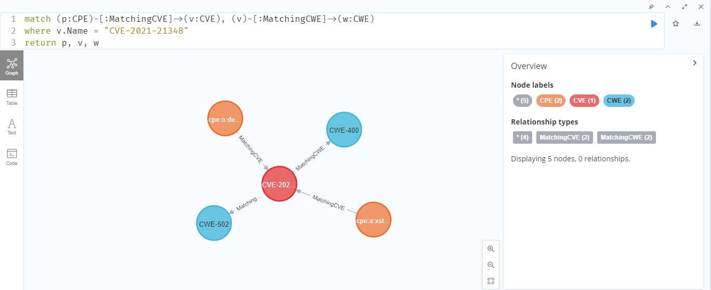

# Import Threat Knowledge Graph to Neo4j

## Preparation

Download and install [Neo4j Desktop](https://neo4j.com/download-center/#desktop). The desktop edition requires registration for downloading and is used for local development.

Note: Neo4j also has server editions (enterprise and community), though I have not tried myself. The desktop edition works like a local enterprise edition.

After Neo4j Desktop is installed, we first need to create a new database for storing the knowledge graph. The databases are managed under the *Database Management System (DBMS)* in each *project*.

To create a new project, click the "new" button at the top left corner, then select "create project".

In the new project, click the "Add" buttion and select "Local DBMS". Then, fill in the name, password, and select the version. DBMS version 4.3.1 is tested to work well.

Before starting the DBMS, we also need the APOC plugin for importing. There exist multiple ways for data import, and I choose APOC for its usability and simplicity. Click the DBMS for our knowledge graph, then click the "Plugins" tab on the right, there is an option to install the plugin. The compatible version of APOC will be automatcally provided.

## Import knowledge graph

The threat knowledge graph is imported from the following files. The knowledge graph uses data available on August 4, 2021.

The following files contain the CPE/CVE/CWE nodes, and the CPE-CVE and CVE-CWE relations. Note that the only the weakness entries in the CWE are included here.

- `cpe-neo4j.csv`
- `cve-neo4j.csv`
- `cwe-neo4j.csv`
- `cpe2cve.csv`
- `cve2cwe.csv`
  
The following files contain additional information from the CWE. Besides weaknesses, CWE also have view/category entries that grouping the weakness entries. Moreover, `cwe-relations` is about the relations between the weakness entries (e.g., ChildOf, PeerOf), `view-relations` is about the relations between the views and weaknesses, and `cate-relations` is about the relations between the categories and weaknesses.

- `cwe-relations.csv`
- `view-neo4j.csv`
- `view-relations.csv`
- `cate-neo4j.csv`
- `cate-relations.csv`

All the nodes need `:LABEL` defined, and all relations need `:TYPE` defined. The headers for all the files above are:

cpe: `Name:ID,Part,Vendor,Product,Target_sw,Target_hw,:LABEL`
cve: `Name:ID,:LABEL`
cwe: `Name:ID,Abstract,Language,Technology,Likelihood_Of_Exploit,Consequence,:LABEL`
cwe-view: `Name:ID,Abstract,:LABEL`
cwe-category: `Name:ID,Abstract,:LABEL`
all the relations: `subject:START_ID,object:END_ID,predicate:STRING,:TYPE`

Move all the files mentioned above under the folder `/import` of the DBMS. The folder can be opened by "..."->"Open folder"->"Import".

We also need to configure the APOC plugin for data import. Open the DBMS folder by "..."->"Open folder"->"DBMS". Then, in the directory, open the `/conf` folder. Create a file called `apoc.conf`, which include the following lines:

    apoc.import.file.enabled=true

    apoc.import.file.use_neo4j_config=true

The DBMS needs to be restarted after this. [References on apoc configuration](https://community.neo4j.com/t5/neo4j-graph-platform/setting-apoc-import-file-enabled-true-in-your-neo4j-conf/m-p/46405).

Clicking `open` will open the Neo4j browser, where queries and commands can be given as input.

The command for [data import with APOC](https://neo4j.com/labs/apoc/4.1/import/import-csv/) is `apoc.import.csv(<nodes>, <relationships>, <config>)`.

First, set the constraints to avoid duplicate node:

    CREATE CONSTRAINT UniqueCPEId ON (p:CPE) ASSERT p.ID IS UNIQUE;
    CREATE CONSTRAINT UniqueCWEId ON (w:CWE) ASSERT w.ID IS UNIQUE;
    CREATE CONSTRAINT UniqueCVEId ON (v:CVE) ASSERT v.ID IS UNIQUE;
    CREATE CONSTRAINT UniqueVIEWId ON (view:VIEW) ASSERT view.ID IS UNIQUE;
    CREATE CONSTRAINT UniqueCATEId ON (cate:CATEGORY) ASSERT cate.ID IS UNIQUE;

In order to import the files above, run the following commmand (remove the line breaks when using). The command is also saved in `data-import.txt`.

    CALL apoc.import.csv([{fileName: 'file:cpe_neo4j.csv', labels: ['CPE']}, 
    {fileName: 'file:cve_neo4j.csv', labels: ['CVE']}, 
    {fileName: 'file:cwe_neo4j.csv', labels: ['CWE']}, 
    {fileName: 'file:view_neo4j.csv', labels: ['VIEW']}, 
    {fileName: 'file:cate_neo4j.csv', labels: ['CATEGORY']}], 
    [{fileName: 'file:cpe2cve.csv', type:'MatchingCVE'}, 
    {fileName: 'file:cve2cwe.csv', type:'MatchingCWE'},
    {fileName: 'file:cwe_relations.csv', type:'RelatedTo'},
    {fileName: 'file:view_relations.csv', type:'HasMember'},
    {fileName: 'file:cate_relations.csv', type:'HasMember'}], 
    {})

<!-- One-line version:

    CALL apoc.import.csv([{fileName: 'file:cpe_neo4j.csv', labels: ['CPE']}, {fileName: 'file:cve_neo4j.csv', labels: ['CVE']}, {fileName: 'file:cwe_neo4j.csv', labels: ['CWE']}, {fileName: 'file:view_neo4j.csv', labels: ['VIEW']}, {fileName: 'file:cate_neo4j.csv', labels: ['CATEGORY']}], [{fileName: 'file:cpe2cve.csv', type:'MatchingCVE'}, {fileName: 'file:cve2cwe.csv', type:'MatchingCWE'},{fileName: 'file:cwe_relations.csv', type:'RelatedTo'},{fileName: 'file:view_relations.csv', type:'HasMember'},{fileName: 'file:cate_relations.csv', type:'HasMember'}], {}) -->

(If Neo4j cannot find the location of the files, try `file:/cpe_neo4j.csv`).

## Query data in Neo4j browser

Neo4j uses [Cypher](https://neo4j.com/developer/cypher/) query language for querying data. [Cypher cheat sheet](https://neo4j.com/docs/cypher-cheat-sheet/current/)

In general, to get the desired results, the query is the in the form of

    MATCH (pattern)
    WHERE (condition)
    RETURN (output)

One example pattern is 

    (p:CPE)-[r1:MatchingCVE]->(v:CVE), (v)-[r2:MatchingCWE]->(w:CWE)

(p:CPE) is a node, where p is the variable name and CPE is the LABEL. Variable names can be omitted if not returned in the output.

Verify that we have the correct number of nodes:

    MATCH (p:CPE) return count(p)

The result is 68338. The count() is one of the [aggregate functions](https://neo4j.com/docs/cypher-manual/current/functions/aggregating/) provided by Cypher.

Example of deleting all CPE nodes:

    MATCH (p:CPE) detach delete (p)

Similarly, the number of other types of nodes can be verified (by changing the LABEL in the query). There exist 167542 CVE nodes, 918 CWE nodes, 43 VIEW nodes, and 316 CATEGORY nodes.

The following query returns all the nodes related to CVE-2021-21348.

    match (p:CPE)-[:MatchingCVE]->(v:CVE), (v)-[:MatchingCWE]->(w:CWE)
    where v.Name = "CVE-2021-21348"
    return p, v, w

If there are too many nodes, not all of them will be displayed by default. At the bottom left corner of the browser, the initial number of nodes to display can be configured.

The CPE node may not display anything in the visualization at first. Click the `CPE (2)` on the right, the text to display can be selected. The size and color of nodes can also be set.

On the right of the query, there is a button to save the graph.

Clicking a node in the graph shows three options: lock (left), hide (right), and expand (bottom). Expanding on a node will display all the nodes directly related to the selected node. For example, expand on `cpe:a:xstream_project:xstream` will show all the CVEs that are directly related to it.

Note: the new nodes added by expanding will not be automatically connected to other nodes. For example, the relations between the new CVEs and CWE-502 won't be displayed. In order to display the relations, click the "expand" button of CWE-502 twice, the first will display all nodes directly relatd to CWE-502, the second will leave only the CVEs connected to `cpe:a:xstream_project:xstream`. See the figure below:

Meanwhile, clicking a node will show its properties on the right:

This query returns all of the common CVEs and CWEs shared by `cpe:a:xstream_project:xstream:*:*` and `cpe:a:oracle:banking_platform:*:*`.

    match (p1:CPE)-[:MatchingCVE]->(v:CVE), (p2:CPE)-[:MatchingCVE]->(v), 
        (v)-[:MatchingCWE]->(w:CWE)
    where p1.Name='cpe:a:xstream_project:xstream:*:*' and 
        p2.Name='cpe:a:oracle:banking_platform:*:*'
    return p1, p2, v, w

This query returns the common CVEs shared by 'debian' and 'fedora' that are related to 'CWE-502' or 'CWE-400'.

    match (p1:CPE)-[:MatchingCVE]->(v:CVE), (p2:CPE)-[:MatchingCVE]->(v), 
        (v)-[:MatchingCWE]->(w:CWE)
    where (p1.Name='cpe:o:debian:debian_linux:*:*' 
        and p2.Name='cpe:o:fedoraproject:fedora:*:*') 
        and (w.Name='CWE-502' or w.Name='CWE-400')
    return p1, p2, v, w

The results can also be viewed in other format:

Node properties can also be returned, but in that case there will not be visualization. The result can be exported as `csv` or `json` file.

    match (p1:CPE)-[:MatchingCVE]->(v:CVE), (p2:CPE)-[:MatchingCVE]->(v), 
        (v)-[:MatchingCWE]->(w:CWE)
    where (p1.Name='cpe:o:debian:debian_linux:*:*' 
        and p2.Name='cpe:o:fedoraproject:fedora:*:*') 
        and (w.Name='CWE-502' or w.Name='CWE-400')
    return v.Name

## Query data with Neo4j Python API

The data in the knowledge graph can also be queried through Neo4j Python API. You can find some guide on [their website](https://neo4j.com/developer/python/). In the following, I will show an example of using the Neo4j Python Driver (officially supported by Neo4j) to query the related CVEs/CWEs given a CPE entry.

First, make sure Neo4j support is installed:

    pip install neo4j

A helper class for querying CVEs/CWEs related to a CPE is shown below:

    from neo4j import GraphDatabase

    class HelloWorldExample:

        def __init__(self, uri, user, password):
            self.driver = GraphDatabase.driver(uri, auth=(user, password))

        def close(self):
            self.driver.close()

        def cwe_test(self, message):
            with self.driver.session() as session:
                cwes = session.write_transaction(self._return_cwes, message)
                return cwes

        @staticmethod
        def _return_cwes(tx, message):
            result = tx.run("match (p:CPE)-[r:MatchingCVE]->(v:CVE),(v)-[]->(w:CWE) \
                where p.name = $message \
                return w.Name,w.Abstract, w.Consequence", message=message)
            entire_result = [] # Will contain all the items
            for record in result:
                entire_result.append(record)
            return entire_result

        def cve_test(self, message):
            with self.driver.session() as session:
                cwes = session.write_transaction(self._return_cves, message)
                return cwes

        @staticmethod
        def _return_cves(tx, message):
            result = tx.run("match (p:CPE)-[r:MatchingCVE]->(v:CVE) \
                where p.name = $message \
                return v.Name", message=message)
            entire_result = [] # Will contain all the items
            for record in result:
                entire_result.append(record)
            return entire_result

The username and password need to be configured first in Neo4j database.

Using the helper class, we can query the related CVEs/CWEs. The example below prints 5 CVEs related to `'cpe:a:google:chrome:*:*'`.

    greeter = HelloWorldExample("bolt://localhost:7687", "neo4j", "threat")

    cves = greeter.cve_test('cpe:a:google:chrome:*:*')

    print("Related CVE list: ")
    for i in range(5):
        print(cves[i][0])

    greeter.close()

The output is:

    Related CVE list: 
    CVE-2016-1655
    CVE-2011-2847
    CVE-2011-1059
    CVE-2014-1704
    CVE-2019-5881

In the output list, there will be no duplicate CVEs since CPE and CVE are directly connected, but might exist duplicate CWEs. For example, if we have two connections `CPE1-CVE1-CWE1` and `CPE1-CVE2-CWE1`, then `CWE1` will appear twice in the output list. The next example merges the duplicate CWEs in the output, and counts the number of paths from the given CPE to a CWE.

    import numpy as np
    import pandas as pd

    greeter = HelloWorldExample("bolt://localhost:7687", "neo4j", "threat")

    cwes = greeter.cwe_test('cpe:a:google:chrome:*:*')
    cwes_output = []

    for i in range(len(cwes)):
        cwes_output.append([cwes[i][0], cwes[i][1]])

    df = pd.DataFrame(cwes_output,columns =['CWE-ID', 'Name'])
    df_merged = df.groupby(['CWE-ID']).size().reset_index(name='counts').sort_values('counts', ascending=False)
    print(df_merged .head())

    greeter.close()

The output is:

         CWE-ID  counts
    34  CWE-416     358
    55  CWE-787     247
    7    CWE-20     203
    1   CWE-119     188
    8   CWE-200      89

Combining the Neo4j Python API and pandas, we can get a lot of useful statistics in an automated way.